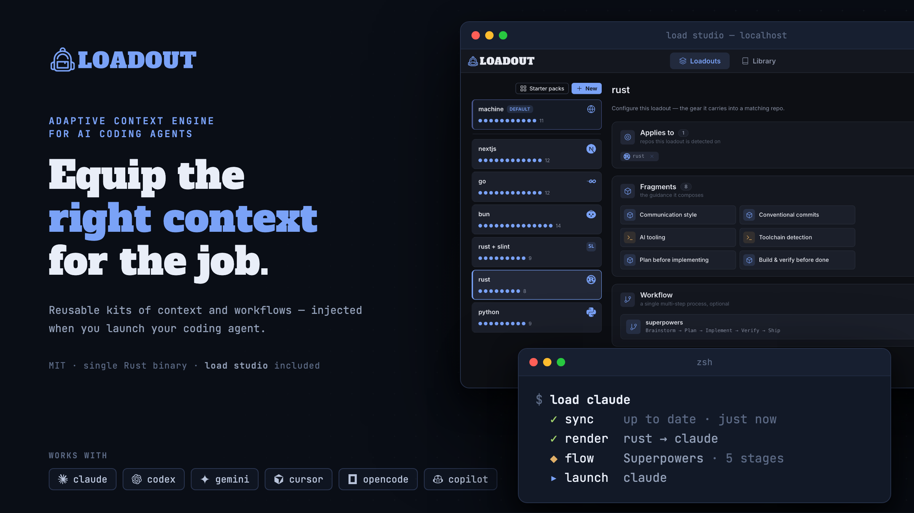
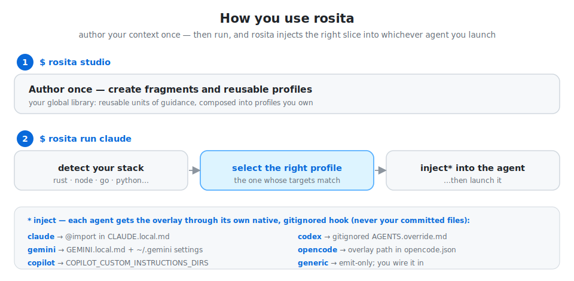
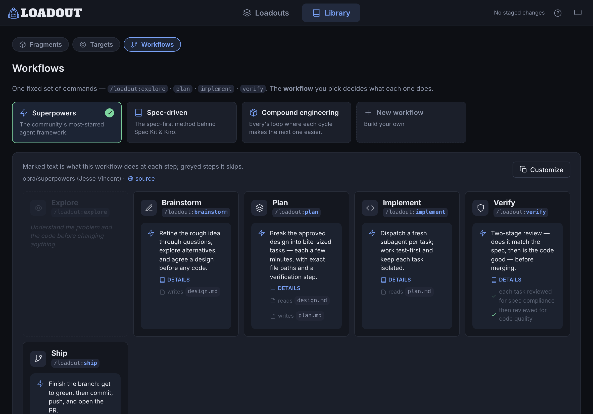
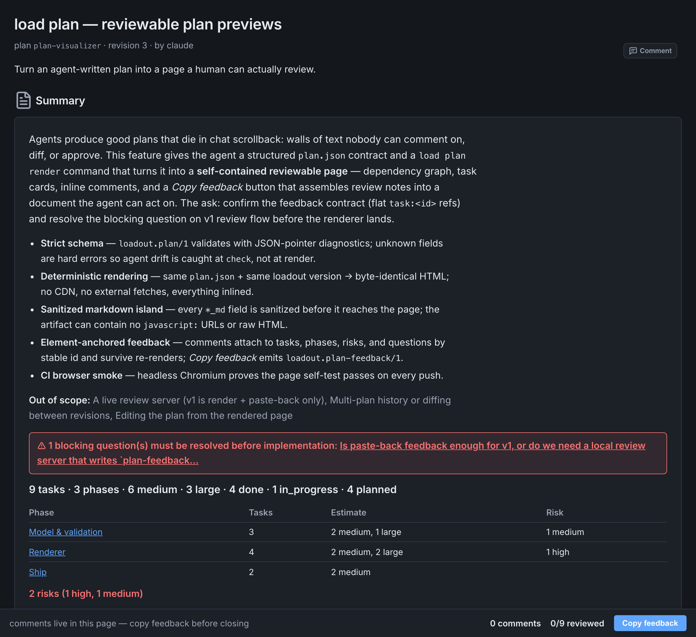
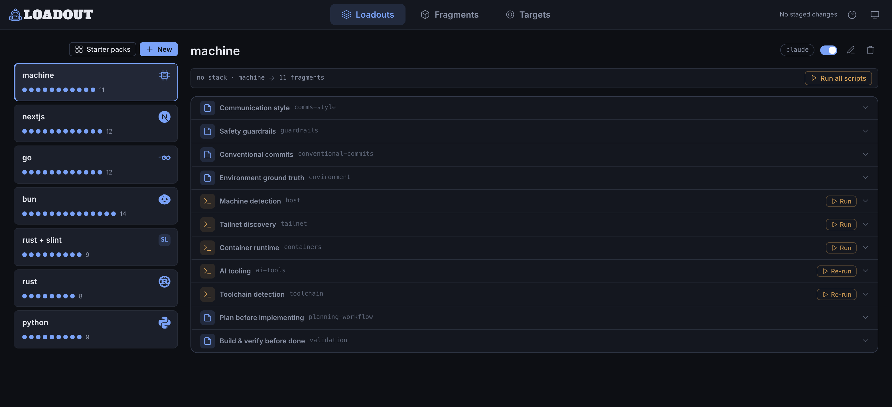

<p align="center">
  
</p>

[](https://github.com/elleryfamilia/loadout/releases)
[](https://github.com/elleryfamilia/loadout/actions/workflows/ci.yml)
[](LICENSE)

**Different work needs different context. Stop handing your agent the same one every time.**

Loadout is the adaptive context engine for AI coding agents. The premise is simple: install it, create *loadouts* for the situations you work in, and your context and workflow are injected dynamically when you launch your agent — `load claude`.

A *loadout* is the kit you equip before a job — your conventions, your tooling, your voice. Loadout picks the right one automatically, whether you're in a Rust repo, a Next.js app, or on a bare server with no repo at all.

- Your project's `AGENTS.md` describes **the repo.**
- Loadout carries **what you bring to it** — across every project, machine, and agent.

Works with **Claude, Codex, Gemini, Cursor, opencode, and Copilot**. Your context arrives as a local, gitignored file each agent reads — committed project instruction files are never touched.

---

## Quick start

If you have Node, one command installs the CLI (it asks first) and opens the studio:

```bash
npx @ellery/loadout studio
```

Or install the prebuilt binary directly — no Rust toolchain needed:

```bash
curl -LsSf https://github.com/elleryfamilia/loadout/releases/latest/download/loadout-installer.sh | sh
```

In the studio, equip a **starter pack** — it detects your stack and recommends one, so you have a working loadout before you've written a word. Reopen it anytime:

```bash
load studio
```

Then launch your agent with your context equipped:

```bash
load claude
```

More install options — source builds, self-updating — under [Install](#install).

---

## How it works

Loadout detects what you're working in, picks the loadout whose targets match, renders its fragments into a local gitignored file — the **overlay** — and wires that into your agent.

```bash
$ load explain

Project
  base   : ~/code/my-rust-app
  branch : main

Detected targets: [rust]

Loadout selection → rust

Active fragments
  • rust-conventions
  • terse-comms

Write plan
  claude:
    created  .loadout/generated/claude.md
    updated  CLAUDE.local.md
```

Selection is deterministic and inspectable — no LLM decides it. The agent only ever sees the finished overlay. Then launch:

```bash
load claude
```

Loadout re-renders the overlay, wires it into Claude, and starts `claude`. The repo gains no committed Loadout content: overlays, bindings, logs, and managed local files are all gitignored.

<p align="center">
  
</p>

---

## The model

Three things you author, one rule for putting them together. Full detail in [docs/concepts.md](docs/concepts.md).

**Fragments** — reusable units of guidance or context. Static text, or dynamic output from a built-in provider or shell command.

```toml
[[fragments]]
id = "rust-conventions"
guidance = "Build with cargo, lint with clippy; prefer ?/Result over unwrap()."

[[fragments]]
id = "terse-comms"
guidance = "Be terse: lead with the result and what changed; skip preamble."
```

**Loadouts** — named kits of fragments, tied to one or more targets. A loadout is the unit of selection: when its targets match, its fragment list is what gets rendered.

```toml
[[loadouts]]
name = "rust"
targets = ["rust"]
fragments = ["rust-conventions", "terse-comms"]
```

**Targets** — the coarse project or environment types Loadout detects: `rust`, `node`, `bun`, `nextjs`, `go`, `python`, `java`, `ruby`, `php`, `swift`, `dotnet`, and `machine` (used when you're not inside a repo — handy for sysadmin and DevOps work).

### The rule

Loadout equips exactly one loadout per context. Loadouts don't merge or stack — composition happens *inside* the chosen one, through its fragment list.

```text
no loadout's targets match  →  a no-targets default applies, else empty
exactly one loadout matches →  use it automatically
multiple loadouts match     →  ask once, then remember the choice for this project
```

---

## Workflows

A loadout carries your *context*. A **workflow** carries your *process* — the way you like to work, across every agent. Loadout exposes one fixed set of six slash commands — `/loadout:explore`, `brainstorm`, `plan`, `implement`, `verify`, `ship` — and the workflow your loadout equips decides what each step *means*. "Plan like spec-kit" and "plan compound-style" are the same `/loadout:plan`, carrying different instructions.

<p align="center">
  
</p>
<p align="center"><sub><i><code>load studio</code> — pick a house process, or build your own; each fills the same six-command spine.</i></sub></p>

Three ship — Superpowers (obra/superpowers), spec-driven (Spec Kit / Kiro), and Every's compound engineering — each modeled on a real framework whose actual skill files are vendored verbatim. Or build your own in `load studio`. A stage can hand a file to the next step (plan writes `plan.md`, implement reads it), which is what makes a workflow more than headings. Equip one on a loadout — in studio's **Workflow slot**, or by hand:

```toml
[[loadouts]]
name = "machine"      # the default (no-targets) loadout → applies everywhere
workflow = "superpowers"
```

Workflows are global-only and never enforced — guidance rendered into each agent, not a runtime. (One naming nuance: Cursor delivers the spine as Skills, so there the commands are invoked `/loadout-explore` — dash, not colon — since Cursor names a skill after its folder.) Full detail in [docs/concepts.md](docs/concepts.md#workflows-implemented).

---

## Plan previews

`load plan` turns an agent-written development plan into a reviewable page instead of a wall of chat text. The loop: the agent (with the embedded `loadout-plan-preview` skill) writes a structured `plan.json`; `load plan check` validates it; `load plan render` renders a self-contained `plan.html` and opens it in your browser; you leave comments on individual tasks, phases, risks, and open questions right on the page; a **Copy feedback** button assembles them into a structured document you paste back to the agent, which revises the plan and re-renders.

<p align="center">
  
</p>
<p align="center"><sub><i><code>load plan render</code> — an agent's plan, rendered for review with element-anchored comments.</i></sub></p>

Rendering is deterministic (the same `plan.json` and loadout version always produce byte-identical HTML) and self-contained — no CDN, no external fetches, everything inlined into one file. Full detail, including the schema and the feedback contract, in [docs/concepts.md](docs/concepts.md#plan-previews-implemented).

---

## Learning

You've told your agent this preference before — in another repo, another session, weeks ago. It doesn't remember; you type it again. **Ambient learning** mines your own recent agent sessions for durable, cross-project preferences you already stated once, and stages what it finds for review — nothing reaches a profile without an explicit promote.

```bash
load learn on
```

prints a plain consent block before it turns anything on: exactly what runs (`load harvest --ambient`, a process you'd see in `ps`, never a daemon), when (after your agent sessions end, or at loadout's own commands, at most once per 6-hour tick), the ceiling (at most one extraction call a tick — four a day at most, per machine, by default), which files it edits (a session-end hook in `~/.claude/settings.json`, one in `~/.cursor/hooks.json`), and a real cost estimate (typically 1-3¢ on a metered API key, $0 marginal on a subscription-backed CLI). `load learn off` turns it back off everywhere it's synced; `load learn status` shows what's on and what's waiting for review; run `load harvest` yourself for a pass on demand.

It reads your own Claude Code, Codex, and Gemini CLI session transcripts — interactive sessions only, secrets redacted before anything is measured or sent anywhere — and stages what it finds in a per-machine journal inside your synced config: claim text syncs, the verbatim quote behind it stays on the machine that observed it. The **studio Inbox tab** is where you decide — promote a candidate into a fragment, dismiss it, or bring a dismissed one back. Same rule as everywhere else in loadout: nothing you didn't explicitly approve ends up in a profile.

---

## Supported agents

Loadout produces one overlay and delivers it the way each agent expects.

| Agent      | Loadout writes                                                            | Default wiring                                                  |
| ---------- | ------------------------------------------------------------------------ | -------------------------------------------------------------- |
| `claude`   | `.loadout/generated/claude.md`                                            | Adds a managed import block to `CLAUDE.local.md`               |
| `codex`    | `.loadout/generated/agents.md`                                            | Merges into gitignored `AGENTS.override.md`                    |
| `gemini`   | `.loadout/generated/gemini.md`                                            | Wires through gitignored `GEMINI.local.md` and Gemini settings |
| `opencode` | `.loadout/generated/opencode.md`                                          | Registers the overlay in global opencode instructions          |
| `copilot`  | `.loadout/generated/copilot/.github/instructions/loadout.instructions.md` | Launches Copilot CLI with the custom instructions directory    |
| `cursor`   | `.cursor/rules/loadout.mdc` (always-on rule)                              | Read by the Cursor IDE **and** `cursor-agent` CLI; a user-level `sessionStart` hook keeps it fresh — and wires a matching repo automatically the first time you open it |
| `generic`  | `.loadout/generated/generic.md`                                           | Emit-only; you wire it yourself                                 |

It never edits committed shared files like `AGENTS.md`, `CLAUDE.md`, `GEMINI.md`, or `.github/copilot-instructions.md` — only local, gitignored paths.

---

## `load studio`

`load studio` opens a localhost-only web UI for your fragment and loadout library. It's a visual editor over your TOML config — not a hidden database. Nothing touches disk until you review and apply the staged diff.

```bash
load studio
```

<p align="center">
  
</p>
<p align="center"><sub><i><code>load studio</code> — a loadout is targets + fragments + an optional workflow, composed visually.</i></sub></p>

Use it to create and edit fragments, compose loadouts, assign them to targets, browse and build [workflows](#workflows), preview generated overlays, run dynamic fragment previews, and review diffs before applying.

It also carries a **starter pack gallery**: ready-made loadouts — everyday essentials plus per-stack kits — with the pack matching your detected stack flagged as recommended. Applying one stages the same edits you'd make by hand: fragments are duplicated into your library as your own, so there's nothing auto-active or magic to un-learn later.

---

## Sync across machines

Fragments and loadouts are global-only, so sharing them is just syncing your global config.

```bash
load sync init                                          # start a config repo
load sync init git@github.com:you/loadout-config.git    # or wire an existing one
load sync clone https://github.com/you/loadout-config.git   # on another machine
```

After that, launching an agent (`load claude`) pulls the latest config before rendering. Your private `local.toml` (hostnames, host classes, machine-specific values) stays local and never syncs.

Sync needs `git` on the machine — minimal images (Proxmox, slim containers) often don't ship it, so `apt install git` first.

---

## Already have a `CLAUDE.md` or `AGENTS.md`?

Don't hand-translate it. Loadout ships an agent skill, [`loadout-migrate`](skills/loadout-migrate/SKILL.md), that reads your existing global agent instructions and turns them into Loadout fragments plus the loadouts you need. Your originals are left untouched.

```bash
load skill install
```

Then, in an agent session, run `/loadout-migrate` or just ask *"Import my CLAUDE.md into Loadout."*

Three more ship: [`loadout-remember`](skills/loadout-remember/SKILL.md) saves a durable cross-project preference as a fragment when you mention one mid-session (instead of leaving it stranded in one agent's memory), [`loadout-import-workflow`](skills/loadout-import-workflow/SKILL.md) turns another repo's command/skill suite into a loadout [workflow](#workflows), and [`loadout-plan-preview`](skills/loadout-plan-preview/SKILL.md) drives the [plan preview](#plan-previews) loop above. The skills follow the cross-agent `SKILL.md` format, so the same install works in Claude Code, Codex, Gemini, opencode, and Cursor.

---

## Where things live

You author fragments and loadouts once, globally. A repo never stores them — it only remembers which loadout to use.

```text
~/.config/loadout/config.toml   # your library — public/shareable
~/.config/loadout/local.toml    # private, gitignored: hostnames, host classes, machine values
.loadout/                       # per-repo, gitignored: overlays, binding, logs, cache
```

A read-only **palette** of starter fragments also ships inside the binary; duplicate one into your library to own and edit it, or let a [starter pack](#load-studio) compose them into a ready-made loadout for you. Repos don't store global fragments or loadouts — if one does, `load doctor` flags it. More in [docs/configuration.md](docs/configuration.md).

---

## Commands

| Command                                      | What it does                                                          |
| -------------------------------------------- | -------------------------------------------------------------------- |
| `load <agent> [args…]`                       | Equip the matching loadout and launch the agent (e.g. `load claude`) |
| `load use <loadout>`                         | Pin this project to a loadout (remembers the choice)                 |
| `load list [fragments\|agents\|targets]`     | List loadouts (default), fragments, agents, or targets               |
| `load edit [name]`                           | Open your config in `$EDITOR`                                        |
| `load studio`                                | Launch the local web UI                                              |
| `load explain [--agent <id>\|all]`           | Show detected context, selected loadout, and write plan             |
| `load refresh [--agent <id>\|all]`           | Render or re-render overlays without launching                      |
| `load clean [--agent <id>\|all]`             | Remove generated overlays and managed blocks                        |
| `load detect [--probes]`                     | Print detected context and optional provider data                   |
| `load doctor`                                | Diagnose config, agents, overlays, and safety issues                |
| `load plan [check\|render\|schema\|clean]`   | Validate, render, and review an agent-written development plan       |
| `load learn [on\|off\|status\|reset]`        | Opt in/out of ambient learning, check status, or re-baseline it       |
| `load harvest`                               | Manually mine recent sessions into the review inbox                  |
| `load trust [--rebuild]`                     | Show the per-machine script-trust store (`--rebuild` re-approves all) |
| `load fragments trust <id>`                  | Re-approve a fragment's script after an out-of-band change          |
| `load targets trust <id>`                    | Re-approve a target's script after an out-of-band change            |
| `load sync [init [url]\|clone <url>]`        | Sync global config across machines                                  |
| `load skill [install\|remove\|status]`       | Manage embedded agent skills                                        |
| `load update [--check]`                      | Self-update installer-based installs                                |

Run `load --help` for the full set and global flags (`--cwd`, `--verbose`, `--dry-run`).

---

## Safety

Generated overlays are agent guidance, not enforced policy — they're regular files an agent reads. Loadout keeps them clean and local: allowlisted env vars only, secret-name denylisting and token redaction, atomic writes, gitignored artifacts, managed marker blocks, context hashes, and `--dry-run` previews. Run `load doctor` to check your setup. Full threat model in [docs/security.md](docs/security.md).

---

## Install

Prebuilt binary — no Rust toolchain needed (macOS and Linux; on Windows use WSL):

```bash
curl -LsSf https://github.com/elleryfamilia/loadout/releases/latest/download/loadout-installer.sh | sh
```

Via npm — [`@ellery/loadout`](https://www.npmjs.com/package/@ellery/loadout) is a thin bootstrapper that runs the same installer after showing you what it will do and asking for consent, then hands off to the `load` CLI. On a machine that already has loadout it checks for a newer release and offers to update (again asking first), then runs your command:

```bash
npx @ellery/loadout studio
```

Installer-based installs update in place with `load update`. From source:

```bash
cargo install --git https://github.com/elleryfamilia/loadout
```

**Verified install channels.** These are the only official sources — treat a binary from anywhere else as untrusted:

- **GitHub releases** — <https://github.com/elleryfamilia/loadout/releases>: the prebuilt binaries and the installer script above, built by cargo-dist from tagged commits of this repo.
- **This repo, from source** — the `cargo install --git …` line above, or a clone and `cargo build`.
- **npm** — [`@ellery/loadout`](https://www.npmjs.com/package/@ellery/loadout): contains no binaries; with your consent it runs the installer script from the GitHub releases above, then delegates to the installed `load`.

There is no official Homebrew tap or other third-party package today.

---

## Documentation

Full docs live in [`docs/`](docs/):

- [Concepts](docs/concepts.md) — the model, selection, providers, freshness
- [Configuration](docs/configuration.md) — config layers, templates, dynamic fragments
- [Security & trust](docs/security.md)
- [Architecture](docs/architecture.md) · [Extending](docs/extending.md) · [Testing](docs/testing.md)

---

## License

Licensed under the [MIT License](LICENSE). Unless you state otherwise, any contribution you submit shall be licensed as above, without additional terms.
